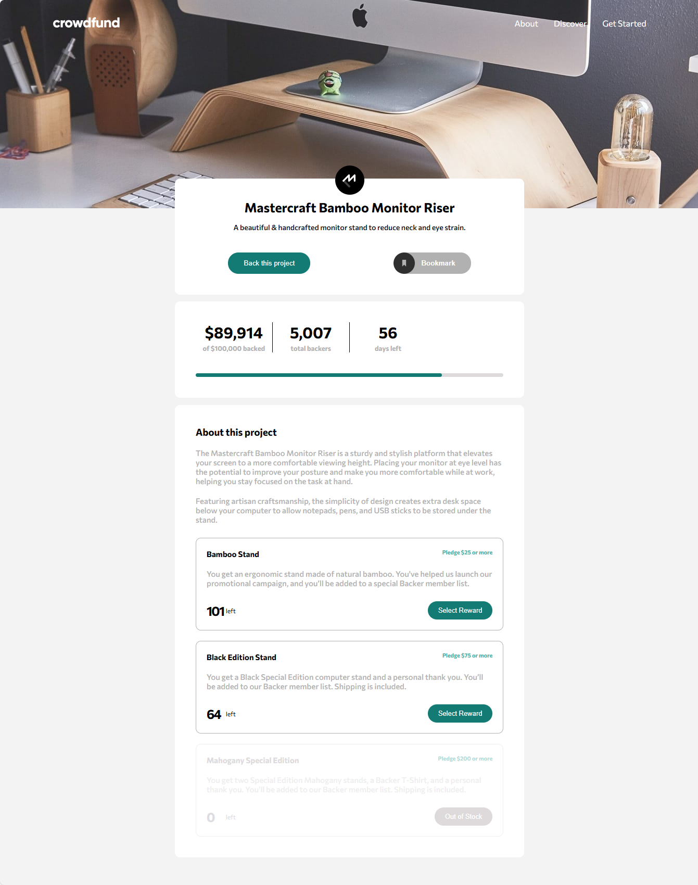
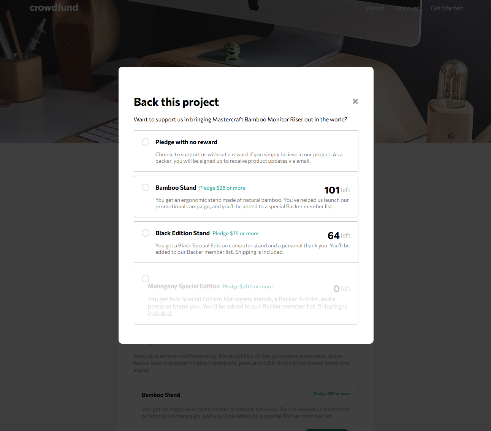
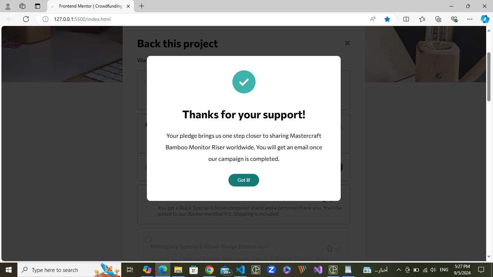

# Frontend Mentor - Crowdfunding product page

This is a solution to the [Crowdfunding product page](https://www.frontendmentor.io/challenges/crowdfunding-product-page-7uvcZe7ZR). Frontend Mentor challenges help you improve your coding skills by building realistic projects.

## Table of contents

- [Overview](#overview)
  - [The challenge](#the-challenge)
  - [Screenshot](#screenshot)
  - [Links](#links)
  - [Installation](#Installation)
- [My process](#my-process)
  - [Features](#Features)
  - [What I learned](#what-i-learned)
  - [Continued development](#continued-development)
- [Author](#author)
- [Acknowledgments](#Acknowledgments)

## Overview

### The challenge

This challenge will test both your layout and state management skills. As visitors make pledges, your goal is to keep track of the changes.

Your users should be able to:

- Make a selection of which pledge to make
- See an updated progress bar and total money raised based on their pledge total after confirming a pledge
- See the number of total backers increment by one after confirming a pledge
- Toggle whether or not the product is bookmarked
- View the optimal layout depending on their device's screen size
- See hover states for interactive elements

### Screenshot





### Links

- Solution URL: [here](https://github.com/olahasan/HTML_CSS_AND_J.S_Frontend-Mentor_JUNIOR-Crowdfunding-product-page)

- Live Site URL: [here](https://olahasan.github.io/HTML_CSS_AND_J.S_Frontend-Mentor_JUNIOR-Crowdfunding-product-page/)

## Installation

To get a local copy up and running, follow these simple steps:

1. **Clone the repository**:

   ```sh
   git clone https://github.com/your-username/your-repo-name.git
   ```

2. **Navigate to the project directory**:

   ```sh
   cd your-repo-name
   ```

3. **Open the project in your preferred code editor**.

## My process

## Features

- Toggle visibility of text and bookmarks.
- Handle button clicks to show/hide overlays and modals.
- Interactive elements with event delegation for efficient event handling.

### What I Learned

- **Event Delegation:** Improved my understanding of event delegation to handle multiple elements with a single event listener.
- **JavaScript Best Practices:** Enhanced my skills in writing clean and maintainable JavaScript code.
- **CSS Flexbox and Grid:** Gained more experience in using CSS Flexbox and Grid for responsive layouts.

### Continued Development

- **Accessibility Improvements:** Plan to enhance the accessibility of the project by adding ARIA roles and improving keyboard navigation.
- **Performance Optimization:** Aim to optimize the performance of the application by reducing the size of assets and improving load times.
- **New Features:** Looking to add new features such as user authentication and dynamic content loading.

### Author

Frontend Mentor - @olahasan<br>
GitHub - @olahasan

### Acknowledgments

I would like to thank the **Frontend Mentor** for providing this challenge and to the community for their support and feedback
